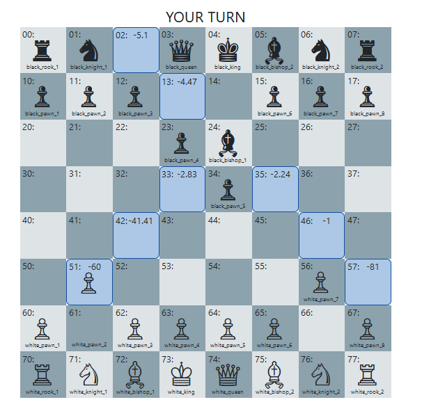
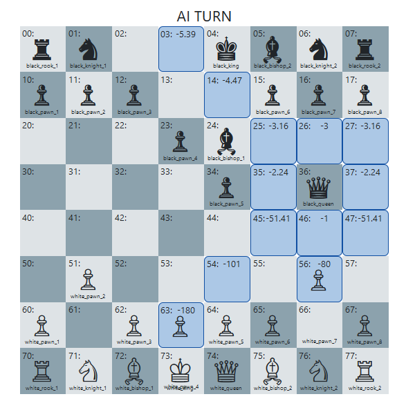

# Backstory and Inspiration

I am dumb at playing chess since childhood. I never won against a good opponent. even at the easiest level in a mobile game. I found some system design notes and problems. I enjoyed solving LLD (low level design) problems in my mind, and then reading the solution to check the depth of my knowledge. I came across designing a chess board game. And the design was very much what I thought, from creating an abstract class for Piece, and inheriting other Pieces from it, each class will have it's methods to move a piece and calculate the score on moving that Piece. Still I have many questions unanswered after that like:

- Is chess really so simple to design using OOP concepts. Does modern games do it like this?
  - I think it is what they do. What other ways could be there?
- How do they manage levels in a chess game?
  - If I had to guess, they take the top 10 moves with high scores and based on level choose the move to play.
- Is chess AI nothing, only a set of rules to decide a move with high score?
  - This is something I had to discover, and I found that there is nothing as AI, it's just some advanced algorithms like minimax/negamax, alpha-beta pruning etc.

Anyways, I decided that I will test myself If I can make a chess game that beats me. I choose Go as the programming language because I have only learnt basics of it, and this would enhance my skills. I choose fyne.io as GUI framework because It was the only one with some good looking easy documentation.

## Finding the best move

I want to keep it simple for the beginning. We will go with only 1 layer, searching for all next possible moves
I found two cases where I need to calculate the score:

1. A piece shouldn't move
2. A piece should move

I think We eventually have to move a piece. so to simplyfy it, I came up with following idea.

- if a piece moves
  - calculate it's score
  - calculate other pieces loss if this one moves.
- final score = sum of both scores
- move the piece with highest score

## Scoring mechanism

I searched for scoring in chess, and found that Rook is given more importance than horse and bishop.
I think this is choice is different from player to player. from my point of view, I will give my Rook to capture opponent's Knight or Bishop. so they all should have equal score.

- a piece gives check to king +20
- a piece captures pawn +20
- a piece captures rook +30
- a piece captures horse +30
- a piece captures bishop +30
- a piece captures queen +40
- a piece captures king +50
- a piece removes check on king +50

- pawn reaches last row +20
- pawn has threat from someone on reaching a position -30
- Rook, Bishop, Knight has threat on reaching a position -40
- Queen has threat on reaching a position -40
- King has threat on reaching a position -50

Giving check to the king is only 20 points because what if your Queen is giving check to the king, but is also in danger. so I kept it minimum.
Initially I started scoring from 10 points, but changed it to 20. Because I realized that there will be situation when the Pieces will try to keep distance from one another, and will result in draw. so I will calculate the absolute distance of a piece from it's nearest enemy and substract his score from that distance.
Getting yourself captured is considered as a loss, and to minimize it, I increased the loss score by +10
That's simple to start.

## March 17,2024

I decided that I want to make a cross platform application, with a stack that I don't know. so that I will be able to learn it. I spent whole day creating the board design in fyne. It's not that simple, the framework is evolving but It doesn't give me what I wanted. I tried to put 64 cells in a 8x8 grid, and resize all cells to 50x50 but the resize was not working. I checked many answers on stack overflow related to resizing but nothing worked. Later I found a video on youtube, the person there did something different from what I was doing (still using the resize function) and it worked. I got super annoyed by it. As you can see I have so much going on in mind related to the chess scoring design and I am stuck on a UI issue. With this I will not be able to go anywhere.

So I went to look for other options the other day. Next language is python. I found QT and tkinter frameworks. I have made a small tik tak toe game in tkinter in past, and it's good too. But QT is most advanced and popular, so I went to look at it's documentation and It's nothing in comparison to React UI libraries / tkinter / fyne. There is no tutorial, only reference to the API, and It's huge. I don't want to go with tkinter because it's very basic, like fyne and I am afraid I will get stuck there too.

Next I know is flutter/dart. I have worked previously on it and it's great. It now supports build for desktop too and has very flexible widgets that you can style as you want. But I need to reinstall it and setup it for desktop and mobile builds. I can't do that, because it will take whole day also and I will not be able to put my ideas into code. I needed something fast. So I decided that I will fallback to React/JS for making the game and then will rewrite the logic on flutter later.

And I think I made the right choice. Making the game on react was so fast because designing the chess board was very easy due to all the HTML and css. I made all chess piece classes, write the move and scoring logic for all of them, and made it run. So far, everything on my head is in the code now. Now I can take a sleep.

The game is very nice, playing by the rules. It is able to beat me at this point, just like any other Chess game. For debugging I added the score so when I click on a piece, it shows me the score of that piece if it moves to one of the movable cells.

There are a few things left to add to it like:

- adding the castling (king and rook interchange position) move
- detecting a checkmate or draw and stopping the game there
- adding the history of moves and undo functionality
- adding animation for a move
- load game from a save file

I realised I am missing 1 thing, which is the motivation to move a pawn. moving it forward will help to promote it, but for the time it needs to be protected well too. That is hard to solve.

## March 18, 2024

Last night, my game was almost complete, so now I had the question can It beat any other chess AI out there? Of course not. Now I have two more questions to answer:

1. What do other chess game engine do differently?
2. Is chess AI a real thing or it's just some more better algorithm?

I spent whole night on internet looking for answers. I found that other chess engines have different scoring mechanism than mine, and different strategy to decide the moves.

One such [implementation](https://andreasstckl.medium.com/writing-a-chess-program-in-one-day-30daff4610ec) is to assign fixed score to every position for a piece, then for each move calculate the sum of all your scores and your opponent score. substract them to get your score for that move. I am not going with that idea because I cannot understand the [piece square table](https://www.chessprogramming.org/Simplified_Evaluation_Function). As this is a stationary table and pieces move on the board.

But this gave me the idea of making my algorithm better.

> **trial 1**: I will try to find all moves, for each move, calculate your and enemy total score from all pieces, and substract them to get final score.

The Implementation also uses minimax and alpha-beta pruning that I am not going to use until I understand those two completely.

---

I keep looking for AI Chess engine implementation, and found about [Stockfish](https://stockfishchess.org/), and [Leela Chess Zero(LC0)](https://lczero.org/). I found that LC0 uses MCTS (Mont-Carlo Tree Search). It's another term I don't want to know about. Because when I hear AI, I want to hear tensorflow/keras in play.

And so I changed the search prompt a little "Neural Network Based Chess Engine".
I found this [repository](https://github.com/undera/chess-engine-nn) which has the Journal of the chess engine progress, I liked reading it and decided that I will maintain my journal too. And so I am writing all this stuff.

At first I wasn't clear about the way he has implemented it. For creating a neural network, what I need is a input layer, output layer, optimizer, and loss function. I was able to get all those from his Journal except the output layer. I was thinking what will be the target we have to predict and what will the output layer give us? How the NN will help us find the best move? Then I found [DeepPink](https://erikbern.com/2014/11/29/deep-learning-for-chess)

It was similar implementation as his journal. I found the output is in form of -1,0,1, where -1 is lose, 0 is draw, 1 is win.
Still after reading all this. I am not able to completely grab everything, like the evaluation function they used. It's just that I don't understand that level of mathematics.

Also about the dataset, they use PGN format, It's good, but I am not sure how to make my matrix using that format now. For now I will generate my own data, if I need more data then I will think of visiting PGN again.

---

Here is what I am going to do:

> **trial 3**: The data is going to be generated by keeping record of all moves of both the players in 8 x 8 x 12 matrix form which tells the position of 12 pieces across 8x8 board. after the result of game, there will be three targets assigned to the moves: 'win', 'lose', 'draw'
> example: if p1 wins, all moves of p1 will be labelled as win.
>
> I will train it using relu, categorical cross entropy, hidden layers not decided, output will be dense(3)

> For prediction, I will to find all 1st level possible moves from current state of board. I am not going deeper to get more moves. I will feed all those moves to my NN. for each prediction output will be three numbers, showing probability of win, lose, and draw. if win is available, highest win probability is selected. else if draw is available, highest draw probability move is selected, else lowest loss probability move is selected.

Before I do that, I want to try other classification algorithms, like decision tree.

> **trial 2**: for that I will convert the data to 2d table, with 1 hot encoding all the dimensions of 8x8x12 and drop 1 column. this will give me 7+7+11 = 25 features

I also had the thought to use score as a parameter in training, but then the results will be highly biased towards the score. so I am dropping this Idea.

---

## March 19, 2024

Woke up this morning with a new Idea. Chess is a sequence of moves, where you can play a certain move only based on the outcomes of all previous moves. so its like an NLP problem, isn't it? We can represent the chess board in form of a long sentence and for each move, we will have to predict the next word in that sentence.
For this I am going to make the data repetative. like if a game has 10 moves, I will make 10 strings, adding 1 move to last one. and then annotate them with win, lose, draw based on what player played the move.
The problem now is how can I represent whole board as a sentence, and if I get the next word in sentence, how will I convert it back to a move. Was looking on internet for any such approach and found this [article](https://towardsdatascience.com/watching-a-language-model-learning-play-chess-f6e6c0e094c) and some other research papers. It's simply a PGN format. But It's little ambiguous to me.

> **trial 4** I will modify the PGN format a little to include the piece type at the beginning of the word. Since training a case sensitive model is not good enough, I will change the piece type notation from k K to bk wk for representing black king and white king.
> A problem that I identified with NLP is what if the predicted word is impossible move? While training, we will add a custom loss function that will increase the loss if the generated move is impossible. and if an impossible move occurs in prediction, we will have to fallback to best scoring move. I am not going to use transfer learning for this, because I am feeding a completely different language.

---

---

## March 28, 2024

some days wasted on fixing some more of the issues

1. I found that **trial 1** is going to do too much computations which are making the browser to hang up and causing issues. So I am dropping that idea.

---

pawn promotion error
